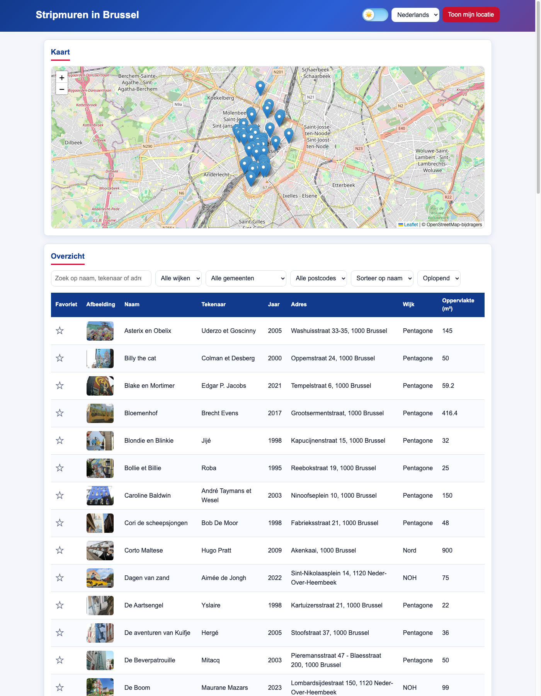
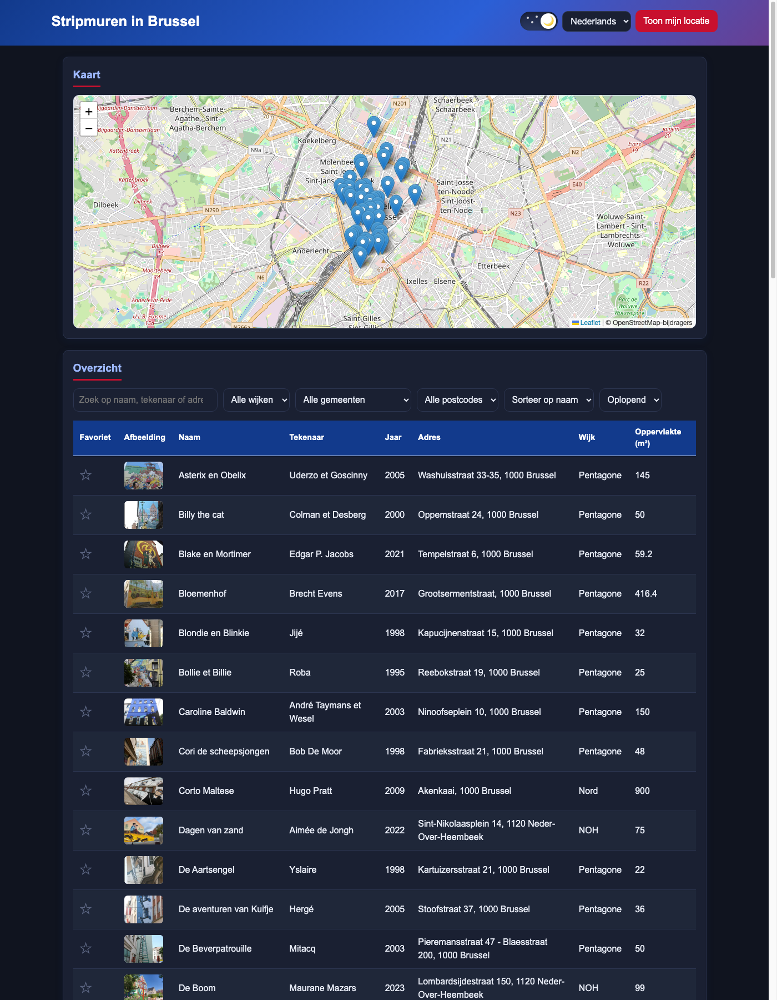
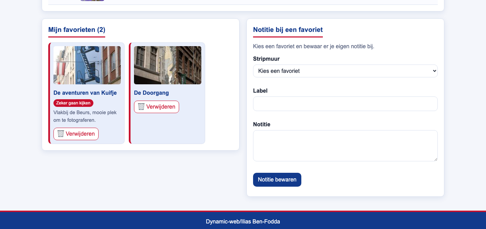

# Stripmuren in Brussel

**Herexamenproject Dynamic Web — Ilias Ben-Fodda**
Repository: https://github.com/IliasBenFodda/DynamicWebHerkansingproject

Brussel staat vol met stripmuren: grote fresco's van Kuifje, Blake en Mortimer, Bollie
en Billie en nog zo'n zestig andere. De stad houdt daar een open dataset van bij, maar
die is niet echt aangenaam om te doorzoeken. Met deze webapp kan je de stripmuren
bekijken op een kaart, doorzoeken in een tabel, filteren per gemeente of wijk, en je
favorieten bijhouden met een eigen notitie erbij.

Alles is gebouwd met vanilla HTML, CSS en JavaScript. De enige externe library is
Leaflet, voor de kaart.



## Inhoud

- [Functionaliteiten](#functionaliteiten)
- [Gebruikte API](#gebruikte-api)
- [Datamodel](#datamodel)
- [Installatie](#installatie)
- [Hoe gebruik je de app?](#hoe-gebruik-je-de-app)
- [Structuur](#structuur)
- [Technische keuzes](#technische-keuzes)
- [Functionele vereisten: waar zitten ze?](#functionele-vereisten-waar-zitten-ze)
- [Technische vereisten: waar en hoe?](#technische-vereisten-waar-en-hoe)
- [Bekende beperkingen](#bekende-beperkingen)
- [Werkwijze en commits](#werkwijze-en-commits)
- [Gebruikte bronnen](#gebruikte-bronnen)
- [Gebruikte AI](#gebruikte-ai)

## Functionaliteiten

- **Kaartweergave** met een marker per stripmuur; klik op een marker voor naam en adres.
- **Tabelweergave** met acht kolommen: favoriet, afbeelding, naam, tekenaar, jaar, adres,
  wijk en oppervlakte.
- **Detailweergave**: klik op een rij en je krijgt de grote foto, alle info en links naar
  Google Maps, Street View en de officiële striproute-site.
- **Zoeken** op naam, tekenaar of adres.
- **Filteren** op wijk, gemeente en postcode. De keuzelijsten worden opgebouwd uit de data
  zelf, dus ze blijven kloppen als de dataset verandert.
- **Sorteren** op naam of jaar, oplopend of aflopend.
- **Favorieten** via het sterretje in de tabel. Ze blijven bewaard na het herladen van de
  pagina en krijgen een eigen overzicht met verwijderknop.
- **Notities** bij een favoriet, via een formulier met eigen validatie.
- **Voorkeuren**: licht/donker thema met een zon-maan toggle, taalkeuze NL/FR en een knop
  die je eigen locatie op de kaart zet. De keuzes blijven bewaard tussen sessies.
- **Lazy loading** van de afbeeldingen met de Intersection Observer.
- **Responsive**: de layout schuift mee op tablet en gsm.

Zoeken, filteren en sorteren werken samen: elke wijziging herberekent dezelfde lijst
(`werkBij` in `js/filters.js`, regels 65-82), zodat tabel, favorieten en het
notitieformulier altijd hetzelfde resultaat tonen.

### Donker thema

Het thema wordt bewaard in LocalStorage, dus de app opent de volgende keer meteen donker.



### Favorieten en notities

Onderaan de pagina staan de favorieten en het notitieformulier. Het formulier laat je
alleen een notitie schrijven bij een muur die je eerst als favoriet hebt gemarkeerd.



## Gebruikte API

Dataset: **Parcours BD / Striproute Brussel** (`bruxelles_parcours_bd`), 70 records.
Dat is ruim meer dan de gevraagde 20 objecten, en elk record heeft genoeg velden om
acht kolommen, een detailweergave, drie filters en een kaart mee te vullen.

- Datasetpagina:
  https://bruxellesdata.opendatasoft.com/explore/dataset/bruxelles_parcours_bd/information/
- Records ophalen:
  `https://bruxellesdata.opendatasoft.com/api/records/1.0/search/?dataset=bruxelles_parcours_bd&rows=100`
- Afbeelding bij een record:
  `https://bruxellesdata.opendatasoft.com/explore/dataset/bruxelles_parcours_bd/files/<image.id>/300/`
  (`/download/` in plaats van `/300/` geeft de volledige afbeelding)

De API vraagt geen sleutel. De data wordt live opgehaald, er staat geen kopie in dit
project.

Voor de kaart gebruik ik daarnaast de tegels van OpenStreetMap via Leaflet.

## Datamodel

De ruwe JSON van de API is niet handig om mee te werken: alles zit onder `fields`, de
namen zijn deels Frans en lege velden ontbreken gewoon. `mapRecord` (`js/render.js`,
regels 12-36) zet elk record om naar een eigen, voorspelbaar object.

| API-veld (`record.fields`)                       | Eigen veld                               | Waar gebruikt                    |
|--------------------------------------------------|------------------------------------------|----------------------------------|
| `record.recordid`                                | `id`                                     | favorieten, notities, detail     |
| `naam_fresco_nl` / `nom_de_la_fresque`           | `naamNl` / `naamFr` → `naam`             | tabel, kaart, zoeken, sorteren   |
| `dessinateur`                                    | `tekenaar`                               | tabel, zoeken, detail            |
| `date`                                           | `jaar`                                   | tabel, sorteren                  |
| `adres_nl` / `adresse_fr`                        | `adresNl` / `adresFr` → `adres`          | tabel, zoeken, kaartpopup        |
| `quartier`                                       | `wijk`                                   | filter wijk, tabel               |
| `gemeente` / `commune`                           | `gemeenteNl` / `gemeenteFr` → `gemeente` | filter gemeente                  |
| `code_postal`                                    | `postcode`                               | filter postcode                  |
| `maison_d_edition`                               | `uitgeverij`                             | detail                           |
| `surface_m2`                                     | `oppervlakte`                            | tabel, detail                    |
| `geo_point`                                      | `coordinaten`                            | marker op de kaart               |
| `link_site_striproute` / `lien_site_parcours_bd` | `weblinkNl` / `weblinkFr` → `weblink`    | detail                           |
| `google_maps`, `google_street_view`              | `googleMaps`, `streetView`               | detail                           |
| `image.id`                                       | `afbeelding`, `afbeeldingGroot`          | tabel (300px), detail (volledig) |

De NL/FR-velden worden allebei bewaard. `vertaalRecord` (`js/render.js`, regels 40-46)
kiest per taalkeuze de juiste variant, zodat de app niet opnieuw moet fetchen bij het
wisselen van taal.

## Installatie

Je hebt niets te installeren en er zijn geen dependencies of build-stappen, maar je moet
de app wel via een lokale webserver openen. Als je `index.html` gewoon dubbelklikt,
blokkeert de browser de fetch naar de API (`file://` heeft geen geldige origin voor CORS).

```bash
git clone https://github.com/IliasBenFodda/DynamicWebHerkansingproject.git
cd DynamicWebHerkansingproject
python3 -m http.server 8000
```

Surf daarna naar http://localhost:8000.

Alternatieven, allemaal even goed:

- `npx serve` (Node)
- WebStorm: rechtsklik op `index.html` → *Open in Browser* (gebruikt de ingebouwde server)
- VS Code: de extensie *Live Server* → *Go Live*

**Vereisten en aandachtspunten**

- Een moderne browser (Chrome, Edge, Firefox of Safari van de laatste jaren). De app
  gebruikt `fetch`, `IntersectionObserver`, arrow functions en de spread-operator.
- Een internetverbinding: data, afbeeldingen, Leaflet en de kaarttegels komen allemaal
  van het net.
- De knop "Toon mijn locatie" werkt enkel op `localhost` of via HTTPS. Browsers blokkeren
  de Geolocation API op onbeveiligde adressen. Je moet de toestemming ook toestaan in de
  pop-up van de browser.
- Favorieten, notities, thema en taal worden in LocalStorage van je browser bewaard. In
  een incognitovenster verdwijnen ze weer bij het sluiten.

## Hoe gebruik je de app?

1. De kaart bovenaan toont alle stripmuren met coördinaten. Klik op een marker voor de
   naam en het adres.
2. Typ in het zoekveld om te zoeken op naam, tekenaar of adres. Combineer dat gerust met
   de filters voor wijk, gemeente en postcode.
3. Sorteer met de twee laatste keuzelijsten op naam of jaar, oplopend of aflopend.
4. Klik op een rij in de tabel voor de detailweergave met de grote foto en de links.
   Sluiten doe je met het kruisje of door naast het venster te klikken.
5. Klik op het sterretje in de eerste kolom om een muur toe te voegen aan je favorieten.
   Ze verschijnen onderaan en blijven bewaard na het herladen.
6. Kies onderaan een favoriet, geef een label (minstens 3 tekens) en een notitie
   (minstens 10 tekens) en bewaar. Bij een fout krijg je een melding onder het veld.
7. Rechtsboven wissel je van thema, van taal (NL/FR) en zet je je eigen locatie op de
   kaart.

## Structuur

```
index.html          opbouw van de pagina, scripts in afhankelijkheidsvolgorde
css/style.css       alle styling, inclusief donker thema en media queries
js/api.js           data ophalen bij de API
js/render.js        records omzetten, tabel en detailweergave
js/filters.js       zoeken, filteren, sorteren en het herladen van de weergave
js/favorites.js     favorieten in LocalStorage
js/validation.js    notitieformulier met validatie
js/preferences.js   vertalingen, thema, taal en geolocatie
js/map.js           Leaflet-kaart en markers
js/observer.js      lazy loading van afbeeldingen
js/main.js          startpunt dat alles aan elkaar hangt
assets/             screenshots voor deze README
```

De scripts staan onderaan `index.html` (regels 90-99) en worden in volgorde geladen,
omdat `main.js` de functies uit de andere bestanden nodig heeft.

## Technische keuzes

- **Vanilla JavaScript, geen framework.** De opdracht draait om de JavaScript-concepten
  zelf. Met React of Vue zouden die concepten achter de library verdwijnen.
- **Geen build-tools, geen npm.** Je kan de map clonen en meteen openen. Dat maakt de
  installatiehandleiding kort en de code makkelijk na te lezen.
- **Losse scripts in plaats van ES-modules.** Met `type="module"` blokkeert de browser
  het laden vanaf `file://` nog strenger, en de laadvolgorde onderaan `index.html` is
  voor een project van deze grootte even duidelijk. Elk bestand heeft één taak en
  exporteert zijn functies via de globale scope.
- **Leaflet als enige library.** De opdracht vraagt naast een tabel ook een visuele
  weergave. Een kaart zelf tekenen met de tegels van OpenStreetMap zou veel code kosten
  die niets met de leerdoelen te maken heeft.
- **Search API v1 in plaats van v2.** Versie 1 geeft de records in één simpele array
  onder `records`, met alle velden onder `fields`. Dat is voor een beginnersproject
  overzichtelijker en de dataset telt maar 70 records, dus paginering is niet nodig.
- **Live data, geen lokale kopie.** Zo blijft de app kloppen als de stad de dataset
  aanpast, en toont het project echt een fetch naar een externe API.
- **Alles in één fetch.** De 70 records passen in één request (`rows=100`). Filteren,
  zoeken en sorteren gebeurt daarna in het geheugen, wat merkbaar sneller aanvoelt dan
  telkens opnieuw de API bevragen.
- **NL/FR in hetzelfde object.** Bij een taalwissel wordt er niet opnieuw gefetcht, enkel
  opnieuw gerenderd.

## Functionele vereisten: waar zitten ze?

| Vereiste uit de opdracht            | Hoe ingevuld                                         | Waar                                                                          |
|-------------------------------------|------------------------------------------------------|-------------------------------------------------------------------------------|
| API met minstens 20 objecten        | 70 records uit `bruxelles_parcours_bd`               | `js/api.js` 1-15                                                              |
| Lijst/tabel met minstens 6 kolommen | 8 kolommen                                           | `js/render.js` 50-82                                                          |
| Extra visuele weergave              | Leaflet-kaart met een marker per stripmuur           | `js/map.js` 10-35                                                             |
| Duidelijke details per locatie      | detailvenster met foto, 8 gegevens en 3 links        | `js/render.js` 87-110                                                         |
| Filterfunctionaliteit               | wijk, gemeente en postcode, gevuld uit de data       | `js/filters.js` 3-21, 30-32                                                   |
| Zoekfunctie                         | zoekt in naam, tekenaar en adres                     | `js/filters.js` 25-29                                                         |
| Sorteermogelijkheden                | op naam of jaar, oplopend of aflopend                | `js/filters.js` 36-47                                                         |
| Favorieten opslaan                  | sterretje per rij, eigen overzicht met verwijderknop | `js/favorites.js` 17-33, 49-86                                                |
| Data bewaren tussen sessies         | LocalStorage voor favorieten, notities, thema, taal  | `js/favorites.js` 5-13, `js/validation.js` 4-13, `js/preferences.js` 195, 201 |
| Gebruikersvoorkeuren                | thema, taal NL/FR en geolocatie                      | `js/preferences.js` 125-133, 137-159, 163-183                                 |
| Responsive design                   | media queries op 900px en 600px                      | `css/style.css` 566, 577                                                      |
| Gebruiksvriendelijke navigatie      | sluitknop, verwijderknoppen, iconen, `aria-label`    | `js/render.js` 90, `js/favorites.js` 69-70                                    |

## Technische vereisten: waar en hoe?

### DOM manipulatie

| Vereiste                        | Bestand            | Regel(s)       | Hoe                                                                  |
|---------------------------------|--------------------|----------------|----------------------------------------------------------------------|
| Elementen selecteren            | `js/main.js`       | 1, 9-18        | `getElementById` haalt status, tabel, detail, favorieten en kaart op |
| Elementen selecteren (meerdere) | `js/render.js`     | 120            | `querySelectorAll("tbody tr")` selecteert alle tabelrijen tegelijk   |
| Elementen manipuleren           | `js/render.js`     | 74-82, 109-115 | `innerHTML` vult de tabel, `classList` toont of verbergt het detail  |
| Elementen aanmaken              | `js/filters.js`    | 14-19          | `createElement("option")` + `appendChild` vult de filterlijsten      |
| Events koppelen                 | `js/render.js`     | 119-128        | `addEventListener("click")` op elke rij opent de detailweergave      |
| Events koppelen (formulier)     | `js/validation.js` | 86-103         | `submit`-listener met `preventDefault()` voor eigen validatie        |

### Modern JavaScript

| Vereiste                  | Bestand            | Regel(s)          | Hoe                                                                  |
|---------------------------|--------------------|-------------------|----------------------------------------------------------------------|
| Constanten                | `js/api.js`        | 3                 | `const API_URL` legt de endpoint vast; alle functies zijn `const`    |
| Template literals         | `js/render.js`     | 62-72             | de volledige tabelrij wordt als één template literal opgebouwd       |
| Iteratie over arrays      | `js/favorites.js`  | 38-45             | `forEach` hangt aan elke sterretjesknop een click-listener           |
| Array methodes            | `js/filters.js`    | 3-6, 23-34, 36-47 | `map`, `filter` en `sort` voor unieke waarden, filteren en sorteren  |
| Array methodes (`find`)   | `js/render.js`     | 124               | `find` zoekt de aangeklikte muur op via `data-id`                    |
| `Set` voor unieke waarden | `js/filters.js`    | 3-6               | `new Set` haalt dubbels uit de wijken, gemeenten en postcodes        |
| Spread-operator           | `js/render.js`     | 40-46             | `...muur` kopieert het record en voegt de vertaalde velden toe       |
| Arrow functions           | `js/api.js`        | 5                 | alle functies in het project zijn arrow functions                    |
| Ternary operator          | `js/filters.js`    | 37                | `richting === "aflopend" ? -1 : 1` draait de sorteervolgorde om      |
| Ternary (genest)          | `js/validation.js` | 63-78             | kiest de juiste foutmelding: leeg, te kort of geen fout              |
| Callback functions        | `js/filters.js`    | 85-87, 94-99      | `werkBij` wordt als callback doorgegeven aan favorieten en validatie |
| Promises                  | `js/api.js`        | 6                 | `fetch` geeft een Promise terug die met `await` wordt afgehandeld    |
| Async & Await             | `js/api.js`        | 5-15              | `async` functie die wacht op de response en op `response.json()`     |
| Async & Await (start)     | `js/main.js`       | 5-29              | `start()` wacht op de data voor de rest van de app wordt opgebouwd   |
| Error handling            | `js/api.js`        | 9-11              | gooit een `Error` als de response niet ok is                         |
| Error handling (opvangen) | `js/main.js`       | 23-28             | `try/catch` toont een leesbare foutmelding in de interface           |
| Observer API              | `js/observer.js`   | 4-24              | `IntersectionObserver` laadt afbeeldingen pas als ze in beeld komen  |

### Data & API

| Vereiste         | Bestand        | Regel(s)      | Hoe                                                                |
|------------------|----------------|---------------|--------------------------------------------------------------------|
| Fetch            | `js/api.js`    | 6             | haalt de 70 records op bij opendata.brussels                       |
| JSON manipuleren | `js/api.js`    | 13-14         | `response.json()` en daarna enkel `data.records` teruggeven        |
| JSON omzetten    | `js/render.js` | 12-36         | `mapRecord` maakt van de ruwe velden een eigen object met defaults |
| JSON weergeven   | `js/render.js` | 62-82, 87-110 | dezelfde objecten vullen de tabel en de detailweergave             |

### Opslag & validatie

| Vereiste                  | Bestand             | Regel(s)      | Hoe                                                                   |
|---------------------------|---------------------|---------------|-----------------------------------------------------------------------|
| Formulier validatie       | `js/validation.js`  | 51-80         | eigen controle: muur gekozen, label ≥ 3 tekens, notitie ≥ 10 tekens   |
| Foutmelding tonen         | `js/validation.js`  | 51-57         | `toonFout` zet de tekst en kleurt het veld via `classList.toggle`     |
| Validatie bij submit      | `js/validation.js`  | 86-103        | `novalidate` op het formulier, dus de controle gebeurt volledig in JS |
| LocalStorage              | `js/favorites.js`   | 5-13          | favorieten als JSON-array onder `stripmuren-favorieten`               |
| LocalStorage (notities)   | `js/validation.js`  | 4-13          | notities als object per record-id onder `stripmuren-notities`         |
| LocalStorage (voorkeuren) | `js/preferences.js` | 120, 195, 201 | thema en taal worden bewaard en bij het opstarten weer ingelezen      |

### Styling & layout

| Vereiste                       | Bestand             | Regel(s)          | Hoe                                                              |
|--------------------------------|---------------------|-------------------|------------------------------------------------------------------|
| Basis HTML layout              | `index.html`        | 32-87             | header, main met panelen en een footer                           |
| Flexbox                        | `css/style.css`     | 22-27, 226-227    | header en de filterbalk schikken zich met flex-wrap              |
| CSS grid                       | `css/style.css`     | 213, 450          | detailinfo en de onderste twee panelen staan in een grid         |
| Basis CSS                      | `css/style.css`     | 1-12              | reset, `box-sizing`, lettertype en basiskleuren                  |
| Donker thema                   | `css/style.css`     | via `body.donker` | één klasse op `body` schakelt alle kleuren om                    |
| Responsive design              | `css/style.css`     | 566, 577          | media queries op 900px (tablet) en 600px (gsm)                   |
| Gebruiksvriendelijke elementen | `js/favorites.js`   | 29-33, 69-70      | ster ☆/★ voor favoriet en een 🗑-verwijderknop per favoriet      |
| Gebruiksvriendelijke elementen | `js/render.js`      | 90                | sluitknop `×` met `aria-label` op de detailweergave              |
| Themaswitcher (zon/maan)       | `js/preferences.js` | 125-133, 193-197  | knop wisselt de klasse `donker` en bewaart de keuze              |
| Taalkeuze NL/FR                | `js/preferences.js` | 137-159, 199-207  | `pasTaalToe` hertekent alle labels, de listener bewaart de taal  |
| Geolocatie                     | `js/preferences.js` | 163-183           | `navigator.geolocation` zet een extra marker op je eigen positie |
| Toegankelijkheid               | `js/favorites.js`   | 32                | `aria-label` wisselt mee met de taal en de status van de knop    |

## Gebruikte bronnen

- Opendata Brussel — dataset `bruxelles_parcours_bd`:
  https://bruxellesdata.opendatasoft.com/explore/dataset/bruxelles_parcours_bd/information/
- Opendatasoft Search API v1 documentatie:
  https://help.opendatasoft.com/apis/ods-search-v1/
- Leaflet documentatie: https://leafletjs.com/reference.html
- MDN Web Docs, onder meer voor `fetch`, `IntersectionObserver`, `localStorage` en
  `navigator.geolocation`: https://developer.mozilla.org/
- OpenStreetMap voor de kaarttegels: https://www.openstreetmap.org/copyright
- Inspiratie voor de zon/maan themaknop:
  https://dribbble.com/shots/14431115-Light-Dark-mode-Toggle-switcher
- Cursusmateriaal Dynamic Web

## Gebruikte AI

Ik heb steeds met copilot gewerkt, die zit in VS Code.
Ik kan dus geen links geven naar chatlogs maar hieronder kan je een oplijsting terugvinden van de dingen waarvoor ik AI
gebruikt hebt.

- De layout van de pagina (css en een stukje html)
- De zon/maan knop
- Stukjes van de favorieten functie om te leren hoe ik dingen in mijn LocalStorage kan opslaan
- De markers op de kaart
- Om de Observer API te begrijpen en implementeren
- Om mijn README op te bouwen
